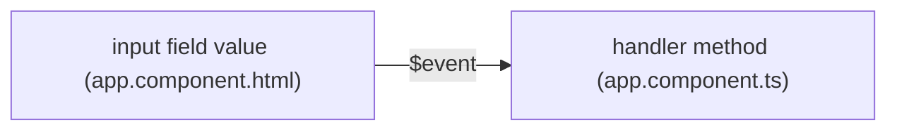
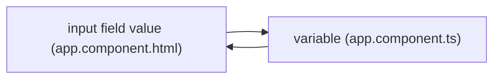

# Ander's Angular Adivce

## Table of Contents
### Will do once finished

## Note
I am making this guide as I am learning Angular from [Maximilian Schwarzmüller's Angular Tutorial](https://www.udemy.com/the-complete-guide-to-angular-2/) as well as googling stuff online. If anything is in quotes, it means I copy and pasted something that was said by someone else. I am writing writing this tutorial using [stackedit](https://stackedit.io/) which has no spell checking so I'm sure I've misspelled a lot of things while writing this.

## Basics
- Angular (currently on Angular 8) is a framework that allows for dynamic, reactive web applications as well as native mobile applications
- It is a combination of TypeScript (a subset of Javascript) and HTML
- The "main" file is `app.component.ts` which is a component itself which is loaded into the home html page, index.html
> *Note: please view this page in Chrome and install the [Github + Mermaid](https://github.com/BackMarket/github-mermaid-extension) Chrome extension to view the graphs properly*

## Components
- Components are similar, one could even say analogous, to classes in OOP (Object Oriented Programming)
- Similar to objects, components are made to be reused in and it helps keep the LOC (lines of code) lower in the main file, `app.component.ts`

## Data Binding
 ### String Interpolation
- Allows you to communicate between your TypeScript code and HTML template in your component by using `[` and `]`
	```html
	<p>Hello, my name is {{ name }}!</p>
	```
- Where `name` is a variable in the corresponding TypeScript code
- The variable being interpolated into a string can be a `string`, `number`, `boolean`, etc. as long as it can be represented as a `string` in the end
- [Example](https://stackblitz.com/edit/angular-cau2tt)
	> Notice the `name` variable in `app.component.ts` and the `{{ name }}` in `app.component.html` 

### Property Binding
- Bind HTML attributes to TypeScript variables using `[` and `]`
	```html
	<button [disabled]="buttonDisabled">Click me</button>
	```
- Where `buttonDisabled` is a variable in a component file
- If `buttonDisabled` is `true`, then the button is disabled, if it is `false`, then the button is enabled
- In this case, the variable we bind is a `boolean`, but what if we bind a `string` or `number`?
	- For a `string` variable, if it is empty, then it is the equivalent of `false`, else it is `true`
	- For a `number` variable, if it is `0` then it is the equivalent of `false`, else it is `true`
- [Example](https://stackblitz.com/edit/angular-2knkts)
	> Notice the `buttonDisabled` variable in `app.component.ts` and the `[disabled]="buttonDisabled"` in `app.component.html` . Try changing the value of `buttonDisabled` from `false` to `true`

### Event Binding
- Bind HTML DOM events such as `click()` to a TypeScript method using `(` and `)`
	```html
	<button (click)="onButtonClick()">Click me</button>
	```
- Where `onButtonClick()` is a method in a component file
- So whenever `click()` fires, it triggers `onButtonClick()`
- [Example](https://stackblitz.com/edit/angular-2knkts)
	> Notice the `onButtonClick()` method in `app.component.ts` and the `(click)="onButtonClick()"` in `app.component.html` 
- *Note from [Maximilian Schwarzmüller](https://twitter.com/maxedapps):*
	> How do you know to which Properties or Events of HTML Elements you may bind? You can basically bind to all Properties and Events - a good idea is to `console.log()` the element you're interested in to see which properties and events it offers
	> **Important**: For events, you don't bind to onclick but only to click (=> (click))
	> The MDN (Mozilla Developer Network) offers nice lists of all properties and events of the element you're interested in. Googling for `YOUR_ELEMENT properties` or `YOUR_ELEMENT events` should yield nice results
- Data can be passed with event by using the reserved `$event` keyword
- `$event` can be passed to the component method through the parameter in the HTML template
	 ```html
	 <input type="text" class="form-control" (input)="inputUpdated($event)"/>
	 ```
- In our TypeScript code, we can reference this via 
	```typescript
	inputUpdated(event: Event) {
		console.log(event.target.value);
	}
	```
	> TypeScript might complain about this syntax because it does not explicitly know that the event has properties we are assuming it to have. All TypeScript knows is that it is an event, not necessarily what kind


> Notice how `value` is red underlined. To fix this, we can be more explicit and type
```typescript
inputUpdated(event: Event) {
	console.log((<HTMLInputElement>event.target).value);
}
```
> Now TypeScript knows that we know that the type of the `HTMLElement` of the event is `HTMLInputElement`


> Notice how `value` is no longer red underlined
- [Example](https://stackblitz.com/edit/angular-9waen7)
> Try typing into the input field and looking at the console:


> Notice how `(input)="inputUpdated($event)"` takes `$event` as a parameter, allowing `app.component.ts` to get information from `app.component.html`. Here we are passing information stored in `$event` in one direction (from `app.component.html` to `app.component.ts`) and logging it in `app.component.ts` via the `inputUpdated` method


### Two-Way Data Binding
- The two-way data binding enables "changes in the application state have been automagically reflected into the view and vise-versa"

> *Note from [Maximilian Schwarzmüller](https://twitter.com/maxedapps):*
> #### Important: FormsModule is Required for Two-Way-Binding!
> Important: For Two-Way-Binding to work, you need to enable the `ngModel` directive. This is done by adding the `FormsModule` to the `imports[]` array in the AppModule. 
> 
> You then also need to add the import from `@angular/forms` in the app.module.ts file:
> 
> `import { FormsModule } from '@angular/forms';`
- With two-way data binding, information is sent in *both* directions instead of only one
- [Example](https://stackblitz.com/edit/angular-pkgmpx)
> *Note: ngModel is a directive but you don't need to know what that is right now*

> Notice the `userInput` variable in `app.component.ts` and the `[(ngModel)]="userInput"` in `app.component.html`. In the previous example, if the value `userInput` is changed in the typescript code, then the value in the input field does not change. Why? Remember, the previous example was a *one* direction data binding so the value of the input field changed the value of `userInput`; however, if the value of `userInput` was changed outside of the input field, then the input field would not update. This is because the input field's value can only be changed if the user types keystrokes into it (like how it would normally work). In our *two* directional example, the value of the input field is tied to the value of `userInput`. So if `userInput` changes, then the value inside the text field changes and vice versa. Try changing the value of the textfield by typing into it, this changed the value of `userInput`. Now click the `Set to "Hello, World!" button` and see how the value of the input field changed to "Hello, World!". When this button is clicked, TypeScript code is run that sets the value of `userInput` to "Hello, World!". Since `userInput` is bound to the input field value, the value of the input field is then set to "Hello, World!".

- Looking at the diagram above, you can see that a change to either the input field value *or* the variable associated with `ngModel` will change the other.

### Binding to Custom Properties
> To use enable custom property bindings for a component, you need to import `Input` from `@angular/core`. Your import statement should look like `import  { Input } from '@angular/core';`
- Enables us to bind to properties, similar to how we did before, but for our own custom components
- To add a bindable property to our own components we do so by creating a variable like we normally do but add `@Input()` in front of it
- An example of this declaration would be `@Input() highlighted: boolean`
- Say my component is named `person` and I want to bind to the highlighted property, then I can simply do
	```html
	<app-person [highlighted]="true"></app-person>
	```
- [Example](https://stackblitz.com/edit/angular-xg2lee)
> This example shows how we pass a `boolean` to the `highlighted` property of the person component. This `highlighted` property is then handled by `person.component.html` where it uses `ngClass` to determine whethere to apply the css class or not
- You can also specify another name for the property if you do not want to use the variable name for binding
	- This other name acts as an alias for binding
- What if instead we want to refer to the property as `hili` when we bind to it because we're lazy and do not want to type highlighted?
- Simply insert `hili` in between the parentheses after `Input` like so `@Input("hili") highlighted: boolean`
- Now we can refer bind to the `highlighted` property under the alias `hili`
	```html
	<app-person [hili]="true"></app-person>
	```
- [Example](https://stackblitz.com/edit/angular-8i8qtm)
> Note: Once you create an alias for a custom property, you can no longer bind to the original property name so `<app-person [highlighted]="true"></app-person>` would not work anymore because angular recognizes `hili` in place of `highlighted` when binding


### Binding to Custom Events


## Directives
- "Directives are instructions in the DOM"
- Example directive:
	```html
	<p appTurnGreen>Receives a green background!</p>
	```
### Structural Directives
- "Structural directives are responsible for HTML layout. They shape or reshape the DOM's *structure*, typically by adding, removing, or manipulating elements."
- Must be prefixed with `*`
#### ngIf
- Used to decide whether to display an element or not
	- This is known as **conditional rendering**
- As long as whatever is in between the `"` and `"` is `true` (e.g. variable, method, expression), then the element will be displayed
```html
<p *ngIf="password.length >= 5">{{ password }} is a valid password</p>
```
> This paragraph tag will only display if `password.length >= 5` evaluates to `true`. `password` is a TypeScript variable.
- [Example](https://stackblitz.com/edit/angular-tnzfsf)
- What if we want to display one thing if something is `true` and another thing if something is `false`? Is there an `ngElse`?
	- Kind of
- You have two options
	1. Writing the same line of code but reverse the boolean
		```html
		<p *ngIf="password.length >= 5">{{ password }} is a valid password</p>
		<p *ngIf="password.length < 5">{{ password }} is too short</p>
		```
	2. Using `ng-template`
		```html
		<p *ngIf="password.length >= 5; else passwordTooShort">{{ password }} is a valid password</p>
		<ng-template #passwordTooShort>
		<p #passwordTooShort>password too short</p>
		</ng-template>
		```
	3. There are a few more ways to achieve conditional rendering [here](https://ultimatecourses.com/blog/angular-ngif-else-then#ngIf_and_Else)
- [Example](https://stackblitz.com/edit/angular-l7ueby)
	> Notice how if the password is less than 5 character you see `password too short` but once it is at least five characters it says `(whatever you typed) is a valid password`
#### ngFor
- Loops through an array to display multiple elements
```html
<p *ngFor="let person of people">{{ person }}</p>
```
> Where `people` is an array in the component
- [Example](https://stackblitz.com/edit/angular-2v9dzs)
	> Notice the `people` array. `*ngFor="let person of people"` means loop through each element in the array `people` and at each index assign the value of the array at that index to `person`
- To get the index of the element in the array with ngFor assign the index to a variable
```html
<p *ngFor="let person of people; let i = index">person #{{ i }} {{ person }}</p>
```
### Attribute Directives
- These directives do not add or remove elements, only change the element it is used on
#### ngStyle
- Used to dynamically apply CSS styles to elements
- In between `"` and `"` you should have a javascript object
- You can use this in a multiple ways as long as there is a javascript object between the quotes. Here are a couple examples
	1. Using a function that returns a javascript object
		```typescript
		getColor() {
			return {backgroundColor: 'green', color: 'white'};
		}
		```
		```html
		<p [ngStyle]="getColor()">Hello, world!<p>
		```
	2. Directly passing the javascript object
		```html
		<p [ngStyle]="{backgroundColor: 'green', color: 'white'}">Hello, world!<p>
		```
- [Example](https://stackblitz.com/edit/angular-p6hawb)
#### ngClass
- Dynamically add or remove CSS classes to elements
- You can have it apply/remove the class conditionally or unconditionally
	1. Conditionally
		```html
		<p [ngClass]="{valid: password.length >= 5}">Password status<p>
		```
		> If the css class name has a `-` (e.g. `valid-password`) then you need to place single quotes around the class name `<p [ngClass]="{'valid-password': password.length >= 5}">Password status<p>`
	2. Uncondtionally
		```html
		<p [ngClass]="'valid'">Password status<p>
		```
	> where `valid` is a css class defined in the .css file associated with a component
- [Example](https://stackblitz.com/edit/angular-mnkems)

#### [Example using ngIf, ngFor, ngClass, and ngStyle](https://stackblitz.com/edit/angular-nxsnso)

## Module
<!--stackedit_data:
eyJoaXN0b3J5IjpbOTk4ODA4MDQyLDExNTcyMzU2MjUsMTY2ND
Q2MjUwMCwtNjU4NDc5OTAsLTIwNTgxNzM2NzYsLTExNDQ2NTk2
NzksLTYzMTI0MDkzMCw5MzI0OTU5MzQsLTE4NTQ1MTI5MjUsLT
g5NDA5NTQyNiwtMTIyNDU0NjA5NywtNzI2NzI2NDI3LC0yMDEz
MDU3MTc0LDIwMDg1NTQ1ODAsMTMzMzQxNTk2MywtMjg1ODk0NT
U3LC0xNjEzMzA0NDkzLDY0MDM1OTIzMywtNTkwNzQ0OTkwLC0x
MTYxMzk5NTkwXX0=
-->